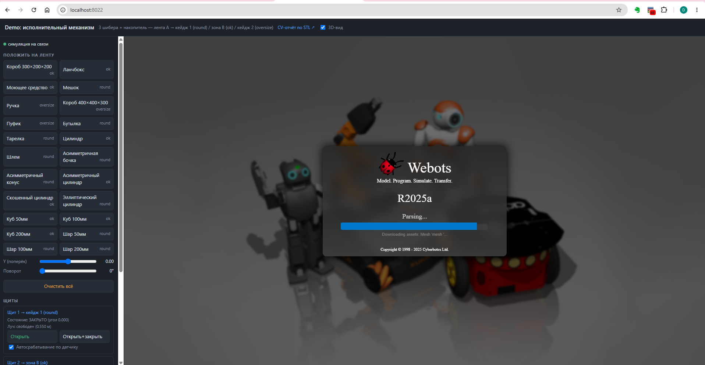
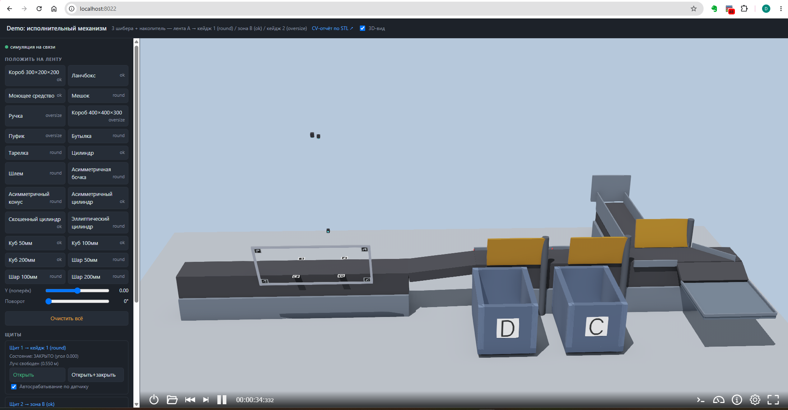
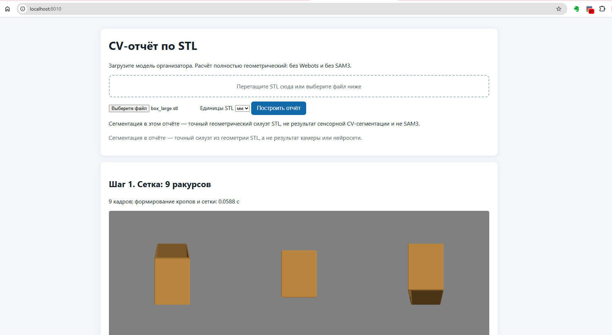

# Robozon — демонстрация сортировки товаров + CV-отчёт по STL

## О решении

Интеллектуальный ПАК сортировки товаров: конвейер с тремя «загребающими»
шиберами (зоны B/C/D) под управлением классического CV с резервной
сегментацией SAM3.

**CV:** риг из 3 камер (top/side/diag) + зеркало для доп. ракурсов,
автопозиционирование по ArUco marker-board. Фоновая HSV-сегментация
(~9–100 мс), 3D-реконструкция по 9 ракурсам на GPU (torchhull), критерий
«круглая проекция» — коэффициент K по 6 направлениям (3 оси инерции +
диагонали, PCA), уточнение для пограничных случаев локальным поиском и
проверкой устойчивости формы по 16 срезам. Классификация — ~150–400 мс.

**Механизм:** оптические датчики барьерного типа перед каждым шибером; CV
заранее рассчитывает момент срабатывания по скорости объекта, датчик даёт
обратную связь для коррекции. Товары без уверенной классификации уходят в
накопитель, не блокируя поток.

**Симуляция** — Webots (headless, демо на сервере организаторов через
браузер): трение, геометрия камер/зеркала, коллизии по упрощённым
3D-моделям. Алгоритмы проверены на силуэтах STL, рендерах Webots
(mean IoU=0.95) и реальных фото. Устойчивая маршрутизация подтверждена
потоковым тестом (кубики/шары, подача каждые 0.7 с).

## Демо

Два независимых демо для проверки решения, каждое — свой процесс и свой порт
(падение одного не останавливает другое):

1. **Исполнительный механизм** (`http://localhost:8022/`) — Webots-сцена
   конвейера с тремя поворотными шиберами: спавн товаров, эмулированная
   CV-классификация с фиксированной задержкой, трекинг объекта по uid,
   сравнение предсказанного и фактического момента срабатывания шибера
   лучевым датчиком. 3D-вид сцены — прямо в браузере (WebSocket-стрим), окно
   Webots открывать не нужно.
2. **CV-отчёт** (`http://localhost:8010/`) — загрузка произвольного STL,
   полностью математический путь (без Webots, без физики, без реальной
   сенсорной сегментации): сетка из 9 ракурсов рига → геометрический силуэт →
   3D-реконструкция (Exact Polyhedral Visual Hull) → триангуляция габаритов →
   вердикт круглости (критерий G4, Rin/Rout) → итоговая категория (B/C/D).
   Каждый шаг — со своим временем расчёта.

## Итоговый отчёт и презентация

Итоговый отчёт по решению и презентация для защиты — один материал
(презентация практически содержит отчёт):
https://disk.ozon-robozon.ru/s/b4gJnsfXSn4F5zs?dir=/Презентация

Видео теста скорости сортировки:
https://disk.ozon-robozon.ru/s/b4gJnsfXSn4F5zs?dir=/Тест%20скорости%20сортировки

## Структура репозитория

```
robozon/           симулятор + CV-отчёт
roboson_tools/      математика CV-отчёта (силуэты, критерий круглости G4,
                    3D-реконструкция) — обязателен РЯДОМ с robozon/ (sibling-
                    репозиторий), код находит его по относительному пути
                    автоматически, отдельно не ставить/запускать
```

Подробное описание подхода и инженерных решений — не только код:
- `roboson_tools/docs/method.md` — описание подхода к определению и
  классификации товара (габариты по силуэтам, критерий «круглая проекция»,
  метод G4, обоснование против альтернатив).
- `robozon/README.md` (раздел «Исполнительный механизм») — компоновка узла
  перекладки, инженерные решения по геометрии шиберов, обработка нештатных
  ситуаций, известные пограничные случаи.

Что к какой части решения относится:

**Определение и классификация товара (CV):**
- `roboson_tools/` — вся математика: силуэты, критерий «круглая проекция»
  (G4), 3D-реконструкция (Exact Polyhedral Visual Hull / torchhull GPU).
- `robozon/tools/cv_report_server.py` + `robozon/tools/cv_report_static/` —
  веб-интерфейс независимого CV-отчёта (порт 8010).
- `robozon/sim/cv_grid.py`, `cv_grid_v2.py`, `cv_localization.py`,
  `cv_moments.py`, `cv_top_tracking.py`, `grid_reconstruction.py`,
  `classifier.py` — CV-пайплайн внутри Webots-сцены (сетка ракурсов,
  локализация объекта, трекинг момента, классификация по круглости).

**Исполнительная часть (управление):**
- `robozon/webots/controllers/` — контроллеры Webots (привод ленты
  `belt_drive`, вращение роликов `roller_spin`, панели управления
  `demo_panel*`, супервизор сцены `supervisor_main`).
- `robozon/sim/collision.py`, `robozon/sim/config.py` — физика и конфигурация
  симуляции.
- `robozon/webots/worlds/*.wbt`, `robozon/tools/gen_demo_mechanism.py` (и
  соседние `gen_*`/`prepare_*` в `robozon/tools/`) — генерация сцены и
  подготовка объектов (коллизии, STL).

**Связка CV↔исполнительная часть и сценарии проверки:**
- `robozon/sim/router.py` — маршрутизация объекта по зоне на основе
  категории, посчитанной CV-частью (ключевая точка связки).
- `robozon/config/objects.yaml`, `robozon/config/layout.yaml` — общая
  конфигурация (категории объектов, геометрия рига/конвейера), читается
  обеими частями.
- `robozon/scripts/run_demo_mechanism.sh` — единая точка запуска обоих демо.
- `robozon/tests/`, `roboson_tools/tests/` — автотесты.
- `robozon/tools/reconstruct_grid.py` — офлайн-сценарий проверки CV-пайплайна
  на захваченных кадрах боевой 9-ракурсной сетки против эталонных категорий
  объектов (`assets/cv_grid_test_frames/`).

## Связь CV и исполнительной части

Результат классификации не передаётся исполнительной части одним разовым
решением — это непрерывный процесс синхронизации по времени:

1. По кадрам с верхней (top) камеры CV-модуль рассчитывает скорость
   движения объекта по ленте.
2. Пока идёт классификация (сегментация → 3D-реконструкция → критерий
   круглости — суммарно порядка 200–450 мс), CV-модуль прогнозирует
   момент, когда объект достигнет оптического датчика нужного шибера
   (зона B — не круглый, D — круглый; для зоны C датчик/шибер не
   используется — прямой проезд без лотка).
3. За 0.2 сек до расчётного момента CV-модуль заранее активирует именно
   тот датчик (барьерного типа), который должен сработать.
4. Датчик срабатывает при физическом прохождении объекта, отправляет
   команду на привод шибера и сообщение обратно CV-модулю с фактическим
   временем срабатывания.
5. CV-модуль использует это фактическое время как поправку — уточняет
   модель движения объекта для следующих товаров в потоке.

Обмен идёт через ПЛК (программируемый логический контроллер) как
промежуточное звено между CV-модулем и физическими устройствами. В коде
репозитория этому слою соответствуют `robozon/sim/router.py` (очереди по
зонам B/D, независимые друг от друга) и контроллеры
`robozon/webots/controllers/supervisor_main`/`demo_panel_mechanism`.

**Ограничения темпа и геометрии:**
- Классификация должна завершиться заметно раньше, чем объект доедет до
  датчика — иначе 0.2-секундного окна на активацию не останется. Устойчивая
  работа потока подтверждена на подаче объекта раз в 0.7 с (см. видео теста
  скорости сортировки выше).
- Обратная связь от датчика — не просто лог, а активная коррекция:
  расхождение между расчётным и фактическим временем используется для
  следующего объекта, не отбрасывается.

**Обработка неоднозначных случаев:**
- Товар без уверенной классификации (сместился/перекрыт другим объектом на
  ленте, либо результат в пограничной зоне критерия круглости) —
  направляется в накопитель. Технически — «по умолчанию»: если ни один
  датчик/шибер не был активирован для этого объекта, он докатывается до
  конца ленты в зону накопления, шибер не используется.

## Установка

```bash
cd robozon

# 1. Системные зависимости (root нужен только на этом шаге)
sudo apt-get update && \
  sudo apt-get install -y python3 python3-pip python3-venv python3-numpy python3-yaml xvfb

# 2. Webots R2025a — в ~/opt/webots, без root (скрипт качает tarball ~150 МБ)
./scripts/install_webots.sh

# 3. Окружение CV-отчёта — venv СТРОГО по пути robozon/.venv-cv (путь зашит в
#    scripts/run_demo_mechanism.sh; свой путь — через переменную окружения
#    CV_REPORT_PYTHON)
python3 -m venv .venv-cv
.venv-cv/bin/pip install -r requirements.txt \
  --extra-index-url https://download.pytorch.org/whl/cu121
```

Версии ПО: протестировано на Ubuntu 24.04 LTS, Webots R2025a, Python 3.12 (должно работать в ≥ 3.10).
Для полноценной проверки (GPU-путь, см. ниже) — NVIDIA-драйвер с поддержкой
CUDA 12.1+.

**GPU нужен для полноценной проверки — без него приложение не упадёт, но
вердикт «круглый/не круглый» не определяется.** Габариты объекта и
визуализация 3D-реконструкции считаются на CPU в любом случае, GPU для них
не требуется. Но сама классификация по круглости (критерий G4, категория
B/C/D) требует torchhull/CUDA: без GPU эта проверка не выполняется вовсе (не
«упрощается» — именно не выполняется), категория принудительно уходит в «C —
требует ручной проверки» с явным предупреждением в отчёте, ниже показывается
только справочная (потенциально неточная) оценка. Для достоверной
автоматической классификации на сервере обязательно должен быть GPU с
рабочим CUDA-путём (см. следующий раздел про диагностику сборки).

Если сервер заведомо без GPU и тяжёлые CUDA-библиотеки
`torch`/`torchvision`/`torchhull` (~4-5 ГБ) не нужны — можно убрать эти
строки и `triton`/`nvidia-*` из `requirements.txt` перед установкой;
приложение продолжит работать в режиме «без автоматической классификации»,
описанном выше.

### Для включения GPU-пути

Проверенная связка: CUDA 12.1 + gcc/g++ 12 (более новый системный gcc, например
13+ на свежих дистрибутивах, может быть НЕСОВМЕСТИМ с CUDA 12.1 — JIT-сборка
`torchhull` при запуске упадёт с ошибкой компилятора). Если ваш дистрибутив
ставит более новый gcc по умолчанию — поставьте gcc-12 отдельно (например,
`apt install gcc-12 g++-12`) и укажите его перед первым запуском:

```bash
export CC=/usr/bin/gcc-12
export CXX=/usr/bin/g++-12
export CUDAHOSTCXX=/usr/bin/g++-12
export CUDA_HOME=/usr/local/cuda-12.1
```

Если сборка всё равно не удастся — приложение НЕ упадёт: CV-отчёт
автоматически перейдёт на CPU-режим с явным предупреждением в интерфейсе.
Причину сбоя сборки (если она есть) ищите в консоли, где запущен
`run_demo_mechanism.sh`, строка `[torchhull] недоступен...`.

## Запуск

```bash
cd robozon
./scripts/run_demo_mechanism.sh            # с дисплеем (десктоп/WSLg)
./scripts/run_demo_mechanism.sh --headless # сервер без дисплея (через xvfb-run)
```

Один скрипт поднимает оба демо. В браузере:

- **http://localhost:8022/** — исполнительный механизм: 3D-вид сцены + панель
  управления (спавн, ручное/автоматическое управление шиберами, список
  объектов со статусами, счётчики точности синхронизации).
- **http://localhost:8010/** — CV-отчёт: загрузка STL (drag&drop или через
  диалог) → галереи изображений по шагам (сетка ракурсов / силуэт /
  реконструкция) → сводка (категория B/C/D, коэффициент k, ось, время
  каждого шага).

### Как выглядит успешный результат

Пока Webots поднимается (см. «Известные особенности» — первый запуск может
занять ~20 секунд), в браузере экран загрузки:



После завершения загрузки панель исполнительного механизма выглядит так:



Пример готового CV-отчёта:



При доступе к серверу удалённо — пробросить оба порта ssh-туннелем:
```bash
ssh -L 8022:localhost:8022 -L 8010:localhost:8010 user@server
```

## Проверка, что всё поднялось

```bash
curl http://localhost:8022/           # HTML панели исполнительного механизма
curl http://localhost:8010/api/health # {"ok": true}
```

## Сценарии проверки решения

**CV-отчёт (http://localhost:8010/) — классификация по одиночному STL:**
1. Загрузить явно круглый объект (например `robozon/assets/stl/ell_cyl.stl`
   или `plate.stl`) — ожидаемая категория D, k ≥ 0.8.
2. Загрузить явно некруглый объект в допуске (`lunchbox.stl`) — ожидаемая
   категория B.
3. Загрузить объект вне габарита (`box_large.stl`, превышает 320 мм по двум
   осям) — ожидаемая категория C по габаритному гейту, независимо от формы.
4. Загрузить объект-ловушку, похожий на куб/короб по диагонали
   (`box_small.stl`, `cyl_skewed.stl`) — показательный тест на «обманчивую»
   круглость: с GPU sustained-check должен корректно понизить вердикт до
   `uncertain`/`not_round`, без GPU автоматическая классификация не
   выполняется вовсе (см. предупреждение про GPU в разделе «Установка»).
5. Обратить внимание на время каждого шага и итоговую сводку с ошибкой
   габаритов относительно исходного STL.

**Исполнительный механизм (http://localhost:8022/) — поток объектов:**
6. Ручной спавн по одному объекту каждой категории (B/C/D) — проверить, что
   объект физически приходит в свою зону (маршрутизация срабатывает по
   датчику перед нужным шибером).
7. Автоматическая подача через веб-панель — сама панель может тормозить
   при высокой частоте спавна, это ограничение веб-интерфейса, не потока
   (устойчивость на темпе 0.7 с уже показана в видео теста скорости
   сортировки выше). Через панель достаточно убедиться, что товар физически
   маршрутизируется в свою зону и не застревает — не пытаться воспроизвести
   через неё высокий темп подачи.

## Известные особенности

- Первый запуск Webots может занять ~20 секунд.
- Предпросмотр CV-камеры на панели механизма (переключатель «cvTopLive», по
  умолчанию выключен) при первом запросе сразу после старта Webots иногда
  возвращает 503 — холодный рендер шейдеров под headless; повторный запрос
  проходит.
- При первом запуске в логе Webots возможны кратковременные предупреждения о
  недоступности мешей/текстур панели (`Connection refused`) — прогрев
  локального HTTP-сервера панели; сцена продолжает работать штатно, повторный
  запуск не требуется.
- Сегментация в CV-отчёте — точный геометрический силуэт STL, не результат
  реальной сенсорной CV-сегментации и не SAM3 (указано и в самом отчёте).
- **Без GPU категория B/C/D в CV-отчёте не определяется автоматически** —
  объект всегда уходит в «C, требует ручной проверки» с явным
  предупреждением (см. «Установка» выше). Для полноценной проверки решения
  нужен сервер с рабочим GPU/CUDA-путём.
